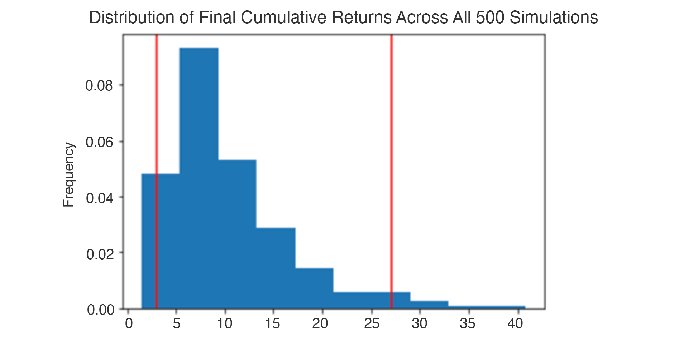

# Project Tile - Financial Planning Tools
The purpose of this project is to build a financial planning tool for emergency and retirement savings for credit union members.  

# Project Description
The financial planning tool dashboard will enable the credit union member to visualize their current savings and determine if there's enough reserves for an emergency fund.  In addition, the credit union members willl be able to forecast the performance of their retirement portfoliio over a 10 or 30 year period through historical financial API price data and Monte Carlo simulations. 

# How to Use the Project

This Challenge breaks the instructions into two parts. In Part 1, you’ll build the financial planner for emergencies. In Part 2, you’ll build the financial planner for retirement.

### Part 1: Create a Financial Planner for Emergencies

In this section, you’ll create a personal financial planner for emergencies. To develop the prototype, assume the following:
<ul>
    <li>The average monthly household income for each credit union member is $12,000.</li>

<li>Each credit union member has a savings portfolio that consists of a cryptocurrency wallet, stocks, and bonds.</li>

</ul>
Use the starter code in financial_planning_tools.ipynb to complete the steps in the following subsections.

#### Evaluate the Cryptocurrency Wallet by Using the Requests Library
In this section, you’ll determine the current value of a member’s cryptocurrency wallet. You’ll collect the current prices for the Bitcoin and Ethereum cryptocurrencies by using the Python Requests library. For the prototype, you’ll assume that the member holds the 1.2 Bitcoins (BTC) and 5.3 Ethereum coins (ETH). To do all this, complete the following steps:
<ol>
    <li>Create a variable named monthly_income, and set its value to 12000.</li>

<li>Use the Requests library to get the current price (in US dollars) of Bitcoin (BTC) and Ethereum (ETH) by using the API endpoints that the starter code supplied.</li>

<li>Navigate the JSON response object to access the current price of each coin, and store each in a variable.</li>
<li>Calculate the value, in US dollars, of the current amount of each cryptocurrency and of the entire cryptocurrency wallet.</li>
</ol>

#### Evaluate the Stock and Bond Holdings by Using the Alpaca SDK
In this section, you’ll determine the current value of a member’s stock and bond holdings. You’ll make an API call to Alpaca via the Alpaca SDK to get the current closing prices of the SPDR S&P 500 ETF Trust (ticker: SPY) and of the iShares Core US Aggregate Bond ETF (ticker: AGG). For the prototype, assume that the member holds 110 shares of SPY, which represents the stock portion of their portfolio, and 200 shares of AGG, which represents the bond portion. To do all this, complete the following steps:
<ol>
<li>In the Starter_Code folder, create an environment file (.env) to store the values of your Alpaca API key and Alpaca secret key.</li>

<li>Set the variables for the Alpaca API and secret keys. Using the Alpaca SDK, create the Alpaca tradeapi.REST object. In this object, include the parameters for the Alpaca API key, the secret key, and the version number.</li>

<li>Set the following parameters for the Alpaca API call:</li>
<ul>
    <li>tickers: Use the tickers for the member’s stock and bond holdings.</li>
    <li>timeframe: Use a time frame of one day.</li>
    <li>start_date and end_date: Use the same date for these parameters, and format them with the date of the previous weekday (or 2020-08-07). This is because you want the one closing price for the most-recent trading day.</li>
</ul>
<li>Get the current closing prices for SPY and AGG by using the Alpaca get_bars function. Format the response as a Pandas DataFrame by including the df property at the end of the get_bars function.</li>

<li>Navigating the Alpaca response DataFrame, select the SPY and AGG closing prices, and store them as variables.</li>

<li>Calculate the value, in US dollars, of the current amount of shares in each of the stock and bond portions of the portfolio, and print the results.</li>
</ol>

#### Evaluate the Emergency Fund
In this section, you’ll use the valuations for the cryptocurrency wallet and for the stock and bond portions of the portfolio to determine if the credit union member has enough savings to build an emergency fund into their financial plan. To do this, complete the following steps:
<ol>
<li>Create a Python list named savings_data that has two elements. The first element contains the total value of the cryptocurrency wallet. The second element contains the total value of the stock and bond portions of the portfolio.</li>

<li>Use the savings_data list to create a Pandas DataFrame named savings_df, and then display this DataFrame. The function to create the DataFrame should take the following three parameters:</li>
<ul>
    <li>savings_data: Use the list that you just created.</li>
<li>columns: Set this parameter equal to a Python list with a single value called amount.</li>
    <li>index: Set this parameter equal to a Python list with the values of crypto and stock/bond.</li>
    </ul>
<li>Use the savings_df DataFrame to plot a pie chart that visualizes the composition of the member’s portfolio. The y-axis of the pie chart uses amount. Be sure to add a title.</li>

<li>Using Python, determine if the current portfolio has enough to create an emergency fund as part of the member’s financial plan. Ideally, an emergency fund should equal to three times the member’s monthly income. To do this, implement the following steps:</li>
<ul>    <li>Create a variable named emergency_fund_value, and set it equal to three times the value of the member’s monthly_income of $12000. (You set this earlier in Part 1).</li>

<li>Create a series of three if statements to determine if the member’s total portfolio is large enough to fund the emergency portfolio:
<ul>
<li>If the total portfolio value is greater than the emergency fund value, display a message congratulating the member for having enough money in this fund.</li>
<li>Else if the total portfolio value is equal to the emergency fund value, display a message congratulating the member on reaching this important financial goal.</li>
<li>Else the total portfolio is less than the emergency fund value, so display a message showing how many dollars away the member is from reaching the goal. (Subtract the total portfolio value from the emergency fund value.)</li>
</ul>
 
    <b>Part 2: Create a Financial Planner for Retirement</b>
 
In this section, you’ll use the Alpaca API to get historical closing prices for a retirement portfolio. You’ll then run Monte Carlo simulations to forecast the portfolio performance 30 years from now. You’ll use the simulated data to answer questions in your Jupyter notebook about the portfolio.

Use the starter code in financial_planning_tools.ipynb to complete the steps in the following subsections.
    
**Create the Monte Carlo Simulation**
 
In this section, you’ll use the MCForecastTools library to create a Monte Carlo simulation for the member’s savings portfolio. To do this, complete the following steps:
<ol>    
<li>Make an API call via the Alpaca SDK to get 3 years of historical closing prices for a traditional 60/40 portfolio split: 60% stocks (SPY) and 40% bonds (AGG).</li>
<li>Run a Monte Carlo simulation of 500 samples and 30 years for the 60/40 portfolio, and then plot the results. The following image shows the overlay line plot resulting from a simulation with these characteristics. However, because a random number generator is used to run each live Monte Carlo simulation, your image will differ slightly from this exact image:</li>
<li>Plot the probability distribution of the Monte Carlo simulation. The following image shows the histogram plot resulting from a simulation with these characteristics. However, because a random number generator is used to run each live Monte Carlo simulation, your image will differ slightly from this exact image:</li>
    

    
<li>Generate the summary statistics for the Monte Carlo simulation.</li>

   
</ol>

**Analyze the Retirement Portfolio Forecasts**
 
Using the current value of only the stock and bond portion of the member's portfolio and the summary statistics that you generated from the Monte Carlo simulation, answer the following question in your Jupyter notebook:

What are the lower and upper bounds for the expected value of the portfolio with a 95% confidence interval?

**Forecast Cumulative Returns in 10 Years**
 
The CTO of the credit union is impressed with your work on these planning tools but wonders if 30 years is a long time to wait until retirement. So, your next task is to adjust the retirement portfolio and run a new Monte Carlo simulation to find out if the changes will allow members to retire earlier.

For this new Monte Carlo simulation, do the following:
<ul>
<li>Forecast the cumulative returns for 10 years from now. Because of the shortened investment horizon (30 years to 10 years), the portfolio needs to invest more heavily in the riskier asset—that is, stock—to help accumulate wealth for retirement.</li>

<li>Adjust the weights of the retirement portfolio so that the composition for the Monte Carlo simulation consists of 20% bonds and 80% stocks.</li>

<li>Run the simulation over 500 samples, and use the same data that the API call to Alpaca generated.</li>
    
<li>Based on the new Monte Carlo simulation, answer the following questions in your Jupyter notebook:
<ul>
<li>Using the current value of only the stock and bond portion of the member's portfolio and the summary statistics that you generated from the new Monte Carlo simulation, what are the lower and upper bounds for the expected value of the portfolio (with the new weights) with a 95% confidence interval?</li>

<li>Will weighting the portfolio more heavily toward stocks allow the credit union members to retire after only 10 years?</li>
    </ul>

# Credits
I would like to give full credit to the products, software and web development teams for their contribution.

# License
No License